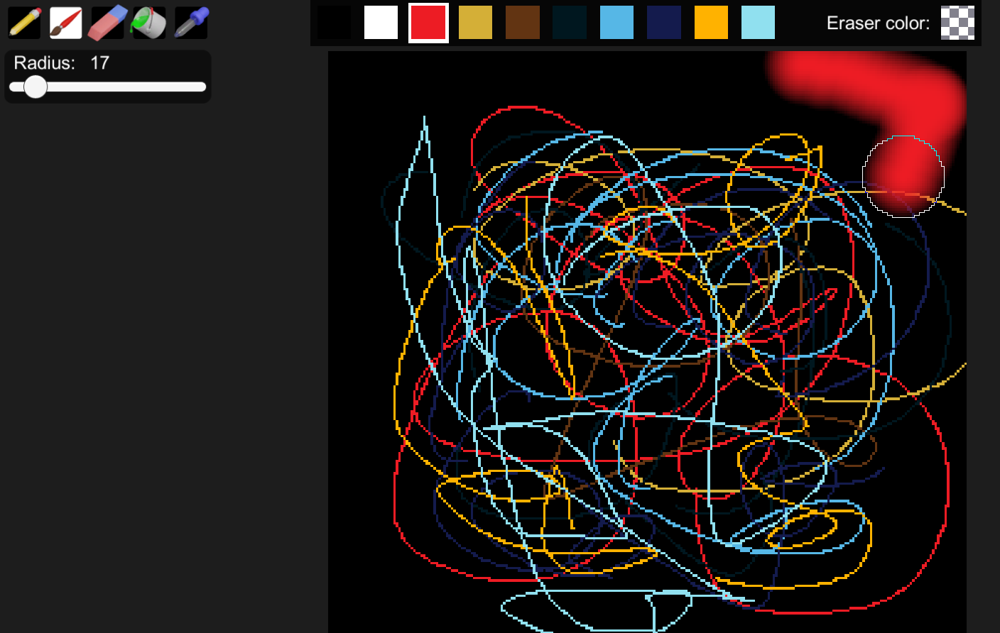
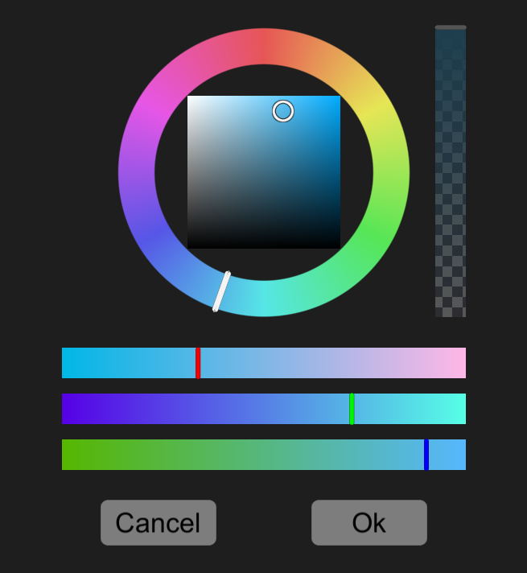

# DrawingProgram
Simple drawing program built from scratch in Unity. Includes simple pencil, brush, eraser, bucket and color picker tools. Implemented by dynamically changing a Texture2D which makes it bit slow for large brush sizes combined with image sizes in millions of pixels.

Each of the colors in the palette at top can be customized using custom color selection tool based on RGBA sliders and a color wheel:

